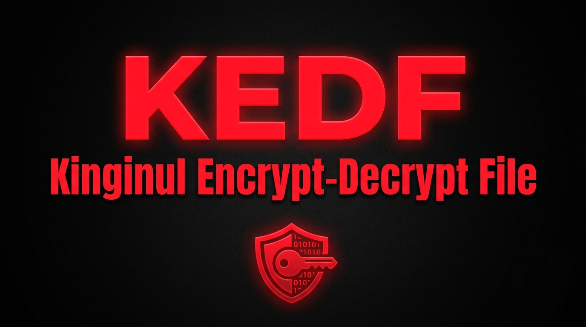
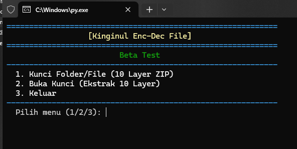

# Kinginul Enc-Dec File



Tool enkripsi dan kompresi berlapis berbasis Python. Mengunci file atau folder dengan proteksi multi-layer AES-256 dan file kunci khusus `.kedf`.

> **Build:** v1.0.1-alpha — versi alpha, gunakan untuk backup dan risiko ditanggung sendiri.

## Preview



---

## Kegunaan

Tool ini dibuat untuk **melindungi data sensitif** (dokumen, arsip proyek, folder pribadi, dll.) dengan cara yang sulit ditembus tanpa kunci yang benar.

**Cocok dipakai jika Anda ingin:**

- Menyimpan file penting dalam bentuk terenkripsi di disk atau cloud
- Menambah lapisan keamanan di luar sekadar password satu kali
- Menyembunyikan struktur file asli agar tidak langsung terlihat sebagai arsip ZIP
- Mencegah orang iseng membuka file kunci hanya karena ikut merename atau mengganti nama

**Yang Anda butuhkan untuk membuka kembali:**

1. File kunci `.kedf` **dengan nama asli** (tidak boleh di-rename)
2. Semua file layer `.kf` (10 buah) di folder yang sama
3. Master password yang Anda buat saat enkripsi

Tanpa ketiganya, data **tidak bisa** dipulihkan.

---

## Fitur

### Keamanan inti

| Fitur | Penjelasan |
|---|---|
| **10 layer AES-256** | Setiap layer adalah arsip ZIP terenkripsi dengan password acak 64 karakter. Harus dibuka satu per satu dari layer 10 → 1. |
| **File kunci `.kedf`** | Menyimpan daftar layer, nama file, dan password per layer — dienkripsi dengan Master Password. |
| **PBKDF2 (600.000 iterasi)** | Master password di-hash kuat sebelum dipakai mendekripsi isi `.kedf`. |
| **Fernet** | Enkripsi simetris untuk payload di dalam file `.kedf`. |

### Fitur anti-clue (v1.0.1)

| Fitur | Penjelasan |
|---|---|
| **Ekstensi `.kf` (Kinginul File)** | File layer tidak memakai ekstensi `.zip` sehingga tidak langsung terlihat sebagai arsip. |
| **XOR obfuscation** | Isi setiap file `.kf` di-XOR setelah dibuat. Magic bytes ZIP (`PK\x03\x04`) tidak terbaca di hex editor atau deteksi signature. Ini **penyamuan**, bukan enkripsi tambahan — kekuatan utama tetap AES-256 di dalam arsip. |
| **Kunci terikat nama file `.kedf`** | Penurunan kunci (KDF) memakai `Master Password + nama file .kedf`. Jika file `.kedf` di-rename, kunci yang dihasilkan salah → dekripsi gagal dengan pesan yang **sama** seperti password salah. Tidak ada petunjuk bahwa penyebabnya rename. |

### Fitur pendukung

- **Zip-slip protection** — Ekstraksi menolak path yang keluar dari folder tujuan.
- **Progress file** — Jika proses terputus di tengah, jejak layer tersimpan di `*.kedf.progress` (sebelum `.kedf` final dibuat).
- **CLI interaktif** — Menu terminal dengan animasi loading dan pewarnaan teks.

---

## Cara Pemakaian

### 1. Instalasi

Pastikan Python 3 sudah terpasang, lalu:

```bash
pip install -r requirements.txt
```

Dependensi: `colorama`, `pyzipper`, `cryptography`.

### 2. Menjalankan program

```bash
python main.py
```

Menu utama:

```
  1. Kunci Folder/File (10 Layer ZIP)
  2. Buka Kunci (Ekstrak semua Layer)
  3. Keluar
```

### 3. Mengunci file atau folder (Enkripsi)

1. Pilih menu **1**
2. Masukkan path file atau folder, contoh: `src-edit` atau `D:\dokumen\rahasia.pdf`
3. Tunggu proses 10 layer selesai — setiap layer menghasilkan file `.kf`
4. Buat **Master Password** (minimal 12 karakter) dan konfirmasi
5. Simpan file `.kedf` yang dihasilkan, contoh: `secret_data_a1b2c3d4e5.kedf`

**Setelah selesai**, folder kerja berisi kira-kira:

```
kedf_layer_9_xxxxxxxxxx.kf    ← layer terluar (10)
...
kedf_layer_0_xxxxxxxxxx.kf    ← layer terdalam (1)
secret_data_a1b2c3d4e5.kedf   ← file kunci (JANGAN di-rename)
```

File/folder asli **sudah dihapus** dari lokasi semula.

### 4. Membuka kunci (Dekripsi)

1. Pastikan **semua file `.kf`** dan file `.kedf` ada di **folder yang sama**
2. Pastikan nama file `.kedf` **persis sama** seperti saat enkripsi
3. Pilih menu **2**
4. Masukkan path file `.kedf`
5. Masukkan Master Password
6. Program mengekstrak layer 10 → 1 secara otomatis

File/folder asli akan muncul kembali di folder kerja.

---

## Contoh skenario rename (anti-clue)

```
Enkripsi:
  src-edit/  →  ...  →  secret_data_x7k2m9p4q1.kedf

Buka kunci — BERHASIL:
  secret_data_x7k2m9p4q1.kedf  +  password benar  ✓

Buka kunci — GAGAL (rename):
  backup.kedf  +  password benar  ✗
  → "Password master salah, atau file kunci rusak/dipalsukan."
```

Penyerang tidak mendapat petunjuk bahwa masalahnya adalah nama file, bukan password.

---

## Alur kerja singkat

```
[File/Folder asli]
       ↓  Layer 1: ZIP + AES-256 + XOR → .kf
       ↓  Layer 2: bungkus layer 1 → .kf
       ↓  ...
       ↓  Layer 10 → .kf (file terluar)
       ↓  Metadata layer + password → enkripsi Master Password
[File .kedf] + [10 file .kf]
```

Dekripsi berjalan **terbalik**: baca `.kedf` → XOR-balik setiap `.kf` → buka ZIP di memori → ekstrak sampai file asli kembali.

---

## Catatan keamanan

- **Lupa Master Password** = data tidak bisa dipulihkan. Tidak ada fitur reset.
- **File `.kedf` hilang/rusak** = data tidak bisa dipulihkan meski layer `.kf` masih ada.
- **Jangan rename file `.kedf`** — simpan dengan nama asli persis seperti output enkripsi.
- **Jangan pisahkan file layer** dari folder `.kedf` — semua harus satu lokasi saat dekripsi.
- **Backup** data penting sebelum enkripsi; build ini masih alpha.
- File `.kedf` versi lama (format v1/v2) dan layer tanpa XOR obfuscation **tidak kompatibel** dengan build ini — enkripsi ulang diperlukan.

---

## Teknologi

- **Python 3**
- **PyZipper** — Kompresi dan enkripsi AES-256 pada arsip ZIP
- **Cryptography** — Fernet + PBKDF2HMAC untuk file `.kedf`
- **Colorama** — Pewarnaan terminal

---

## Developer

Dibuat oleh: **Kinginul**

Dilarang menghapus credit atau mengakui project ini sebagai milik pribadi.
